# IFCBox — automatic pipe routing for BIM models

IFCBox takes an **IFC building model**, lets an MEP engineer pick two (or many) points on a floor, and computes a **draft pipe route** that threads through corridors, dodges walls, and prefers door openings — then renders it in an interactive 3D web viewer.

It's a spatial-intelligence engine (Python) behind a FastAPI backend and a React + three.js front end, deployable as a single Docker image on Render with Cloudflare R2 + Postgres. The engine is **discipline-agnostic** — it routes a generic piping system; pressurised distribution (no gravity constraints) is the first focus.

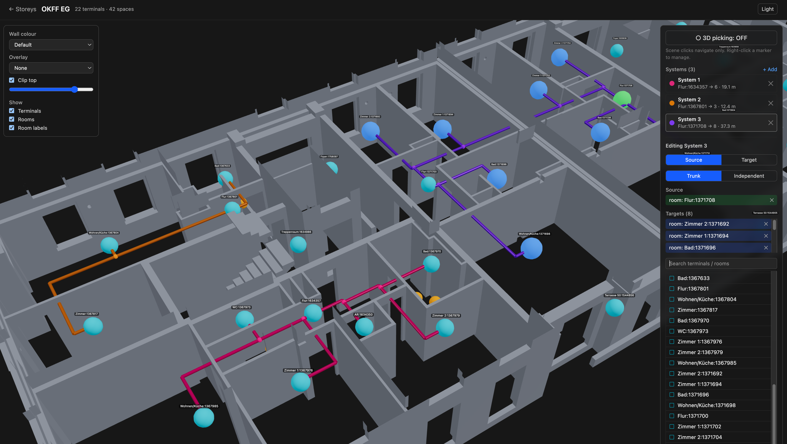

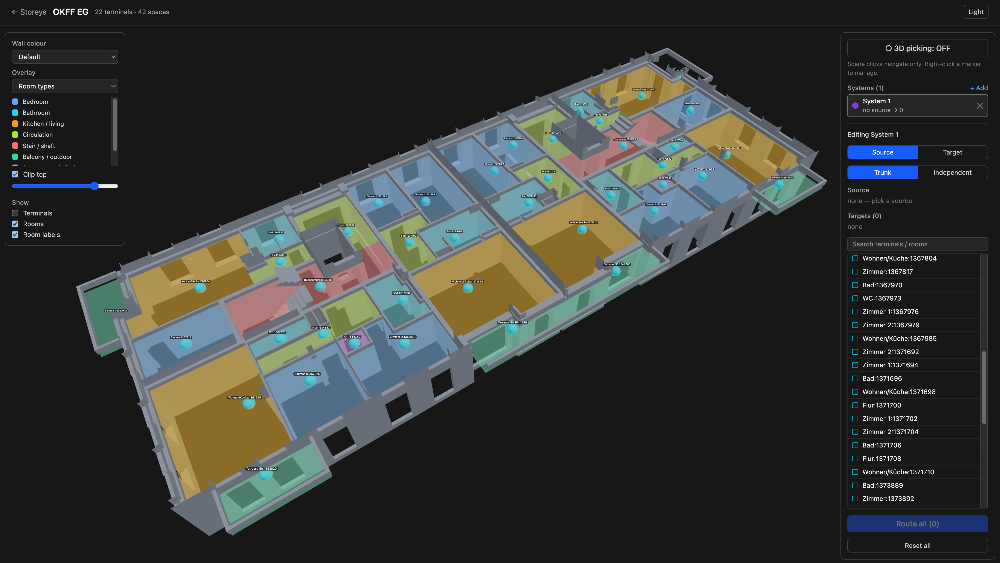

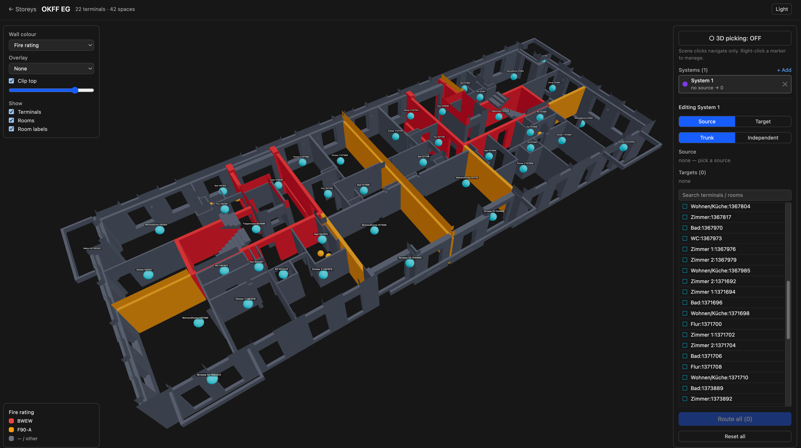

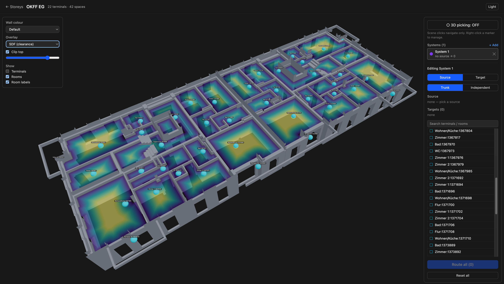

> A prepared floor of the test model: walls colour-coded by fire rating, **green** circulation (Flur), **red** forbidden stairwells (Treppenraum), and room labels, and the signed distance field (SDF) the spatial picture the router works from.

- **Try it / run it locally** (recommended): [docs/USER_GUIDE.md](docs/USER_GUIDE.md)
- **Live demo:** [ifcbox.onrender.com](https://ifcbox.onrender.com/) — gated by a shared app token. ⚠️ Runs on Render free (512 MB) + Neon free Postgres + Cloudflare R2 — **slow / unstable on larger IFCs** (the 38 MB demo model OOMs prep at 512 MB; smaller IFCs work). First request after idle takes ~10–30 s while both Render and Neon cold-start.
- **Deep docs:** [plans index](plans/README.md) · [architecture](docs/architecture.md)

---

## Why

Manual pipe routing (getting a line from A to B through a real building) is the most universal, repetitive pain in MEP design. IFCBox targets a **draft / starting-point** route — fast and useful, without taking on construction-readiness liability. It's discipline-agnostic; pressurised distribution piping (no gravity constraints) is the first focus.

---

## How it works

The engine is a short, legible pipeline over **one storey at a time**. The clever part is turning messy 3D building geometry into a clean 2D cost surface that A\* can search.

### 1 · Extract obstacles from the IFC
`ifcopenshell` tessellates the vertical elements that matter for routing — `IfcWall`, `IfcColumn`, `IfcCurtainWall`, `IfcStair`, `IfcRamp` — in world coordinates. Slabs/roofs/beams are excluded (horizontal/overhead). Everything is rotated into a **site-aligned** frame (building axes → X/Y) for clean voxel alignment, then sliced at the **routing elevation** (`storey + 2.5 m`, above door heads).

### 2 · Voxelise → occupancy grid
Each wall section is rasterised onto a **100 mm 2D boolean grid**. Sub-voxel-thin walls are preserved with a 50 mm dilation, and the exterior is flood-filled to close the perimeter.

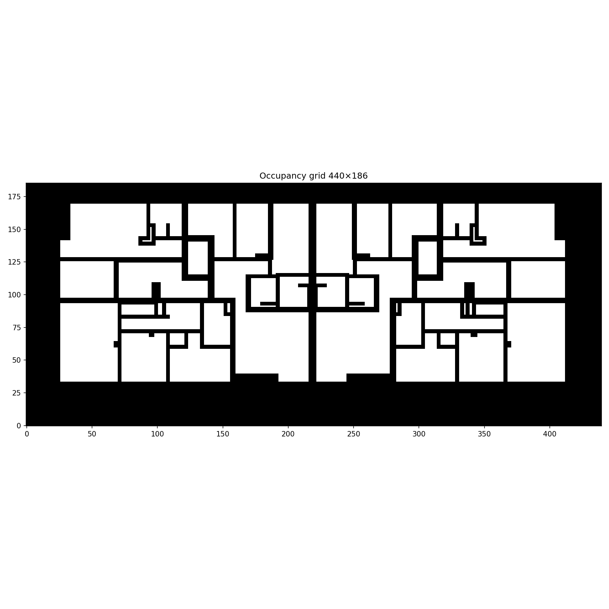

### 3 · Clearance / SDF field
A Euclidean distance transform (`scipy.ndimage.distance_transform_edt`) over the free space gives, for every cell, the **distance to the nearest obstacle**. Bright = deep in open space (room centres, corridors); dark = hugging a wall.

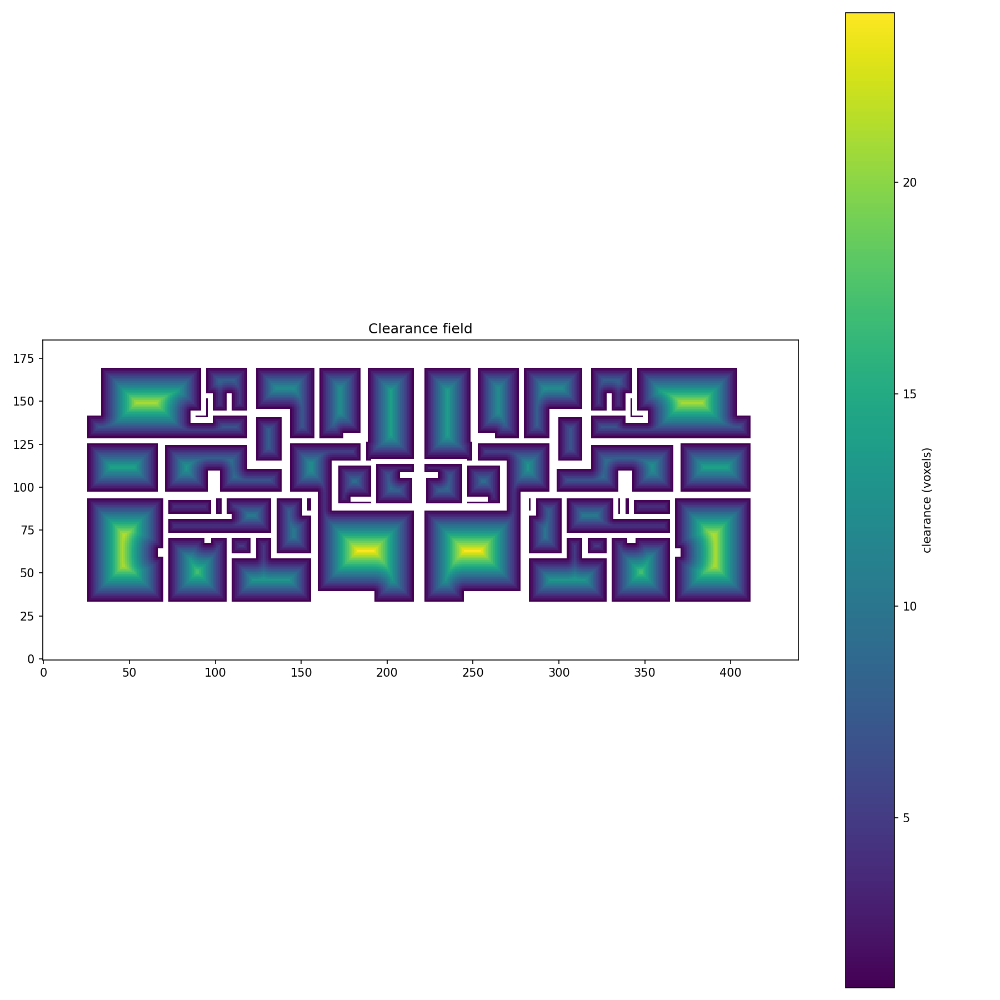

### 4 · Cost grid
The SDF becomes an A\* cost surface:

```
free cell   cost = 1 + clearance_weight / (clearance + ε)   # cheap in the open, dear by walls
wall cell   cost = min(typed_wall_penalty, wall_penalty)     # crossing a wall is expensive…
door zone   cost = 30                                        # …but cheap right at a door opening
corridor    cost ×= corridor_weight (≈0.25)                  # routes prefer circulation space
stair/shaft cost = ∞                                          # forbidden
```

### 5 · Direction-aware A\*
A\* searches the cost grid with state `(x, y, direction)`: **4-connected, 90° bends only**, a configurable penalty per turn, and no U-turns — so paths look like real rigid pipe, not diagonal spaghetti. Endpoints that land inside a wall are nudged to the nearest reachable cell.

### 6 · Smooth → pipe mesh
The voxel path is collapsed to **minimal bend-point waypoints**, transformed back to world coordinates, and extruded into a circular pipe mesh exported as glTF.

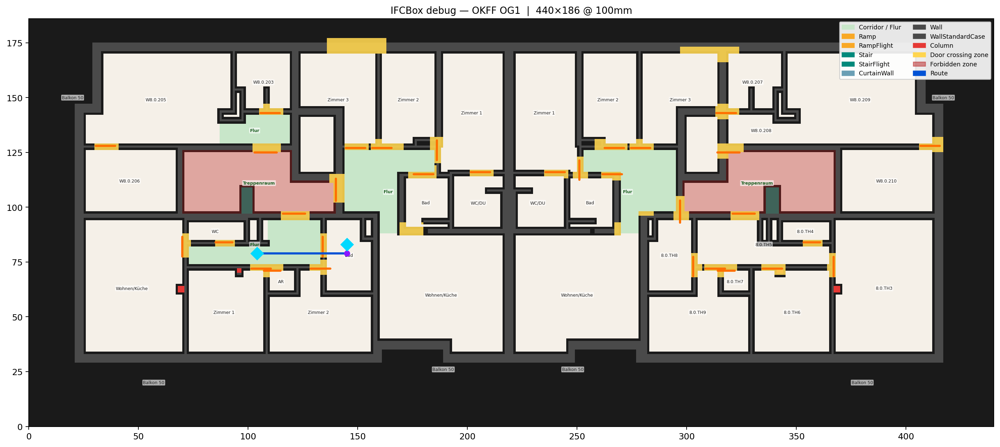

> The same floor with a routed pipe (**blue**) from a corridor to a bathroom; the markers are the collapsed bend points.

### 7 · Multiple targets → shared trunk (Steiner)
For one source feeding many targets, the first target is routed from the source, then each further target is routed from the **existing network** (multi-source A\* seeding) — producing a shared supply main with branches, like real distribution piping. Multiple independent "systems" (e.g. one plant room per zone) are supported.

The same per-floor data also drives the viewer's debug overlays — occupancy, the SDF heatmap, and **room-type** shading — and per-wall colour modes read straight from the IFC: **wall type**, **fire rating**, and **thickness**.

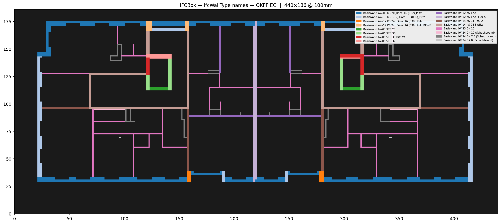
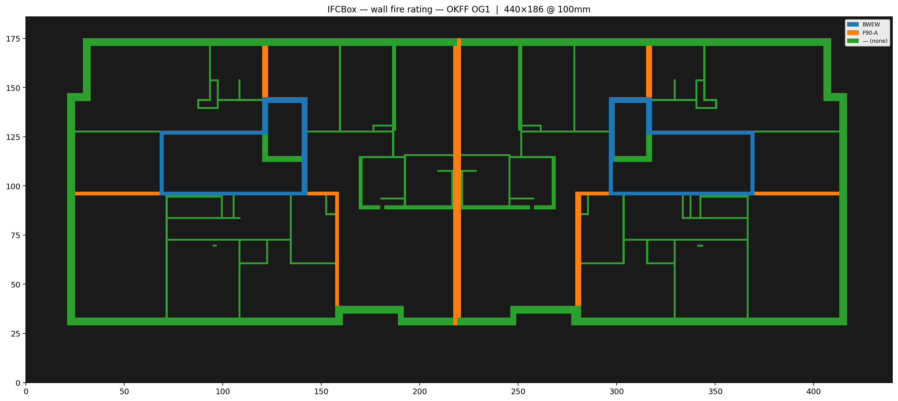
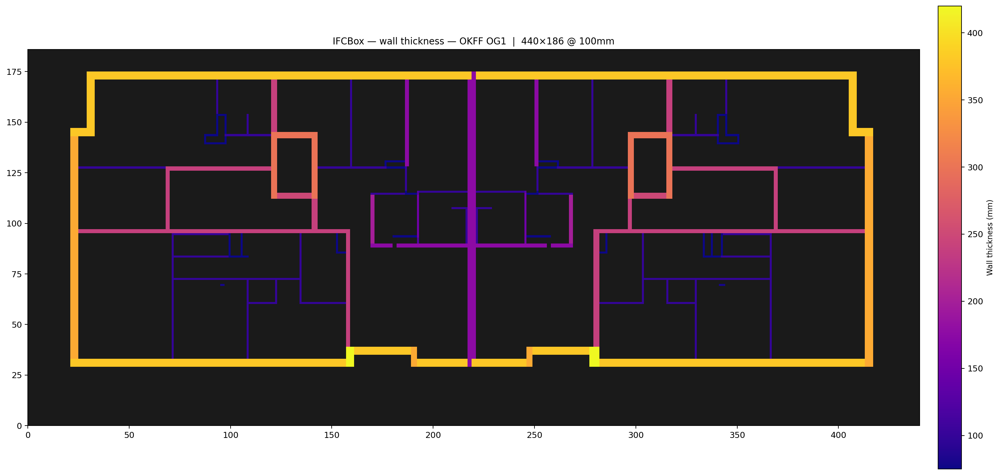

> Fire rating in particular reveals the apartment/compartment boundaries (the F-rated walls), which the planned front-end demo uses to bound each apartment.

### Per-apartment routing (the `demo_routes.py` demo)

`demo_routes.py` auto-discovers the apartments on a storey and routes a shared trunk from each apartment's **hallway (Flur)** to all of its rooms — no manual endpoint picking.

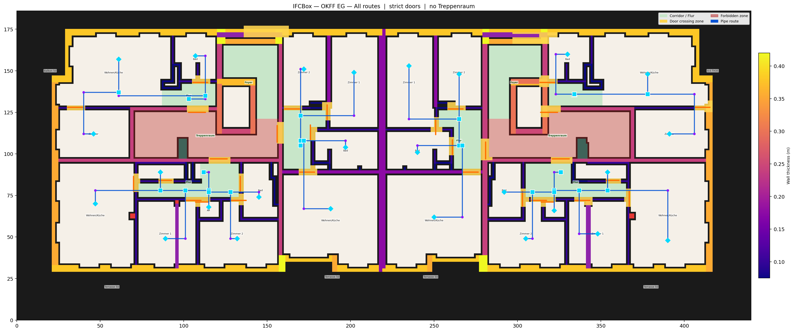

> Ground floor: each apartment's Flur (▢, the trunk source) fans out to its rooms (◆) in blue; walls shaded by thickness, stairwells forbidden (red), door-crossing zones yellow.

How it discovers an apartment, purely from the IFC:
1. **Space footprints** — slice every `IfcSpace` at the floor into a 2D polygon (with a guaranteed-interior representative point as its centroid).
2. **Door-adjacency graph** — for each `IfcDoor`, sample a point 0.35 m to either side (perpendicular to the wall) and record which two spaces it connects → an edge. Open-plan spaces with no wall between them are linked by a small-gap proximity test.
3. **Find the hallways** — `IfcSpace`s named like *Flur / Korridor / Diele* (DE) or *corridor / hall* (EN).
4. **Flood-fill the apartment** — a breadth-first search from each Flur through the door graph collects every room reachable from it; that connected set **is** the apartment.
5. **Route the trunk** — a shared main from the Flur branches to each room (strict door crossings only; never through stairwells).

> The web app ships the same demo as a one-click **"Route apartments (N)"** button — same Flur-rooted BFS plus a fire-edge tag from each door's host wall (`Pset_WallCommon.FireRating` via `IfcRelFillsElement` → `IfcOpeningElement` → `IfcRelVoidsElement`), so the flood-fill stops at the real apartment/compartment boundary. Implementation lives in [`ifcbox/apartments.py`](ifcbox/apartments.py); see [spec-frontend.md §10](plans/spec-frontend.md).

---

## Tech stack

| Layer | Tech |
|---|---|
| Spatial engine | Python · ifcopenshell · trimesh · numpy · scipy · matplotlib |
| Backend API | FastAPI · uvicorn · WebSockets |
| Frontend | React + TypeScript · Vite · three.js / react-three-fiber + drei · Zustand · TanStack Query · Tailwind |
| Storage | Cloudflare **R2** (blobs) · **Postgres**/Neon (metadata) — pluggable with a local FS+SQLite backend for dev |
| Packaging / hosting | Docker (multi-stage) · Render |

**Architecture in one line:** a pure engine library (`ifcbox/`) with a cached, param-independent `PreparedFloor` + a cheap per-request `route()`; a thin FastAPI layer (`api/`) that adds HTTP, storage, auth, and background prep; and a React viewer (`web/`) that renders server-generated glTF. Full detail in [docs/architecture.md](docs/architecture.md).

---

## Development timeline

Built as a focused, AI-pair-programmed sprint. Phase 1 (the spatial PoC) landed 2026-05-28; the engine refactor, full web platform, cloud storage, and deployment followed on 2026-05-29.

| Phase | What shipped | Spec |
|---|---|---|
| **1 — Pipeline** | IFC → voxel → SDF → direction-aware A\* → pipe mesh; CLI + PyVista viewer | [spec-pipeline.md](plans/spec-pipeline.md) |
| **2a — Engine refactor** | PoC orchestration → library engine: `PreparedFloor` + `route()`, anchors (point/terminal/room), trunk vs independent | [spec-api.md](plans/spec-api.md) |
| **2b — Backend API** | FastAPI: upload, lazy background prep (WebSocket progress), sync routing, per-floor glTF; SQLite + 19-test pytest suite | [spec-api.md](plans/spec-api.md) |
| **3 — Frontend** | React + r3f viewer: marker/point picking, multi-source routing, occupancy/SDF/room overlays, wall colour modes, clipping, light/dark | [spec-frontend.md](plans/spec-frontend.md) |
| **3 — Deploy** | Pluggable storage → R2 + Postgres, shared-secret auth, multi-stage Dockerfile, Render blueprint | [spec-deploy.md](plans/spec-deploy.md) |

Running progress + decision log: [plans/progress.md](plans/progress.md).

---

## Repository layout

```
ifcbox/      engine library (pipeline/, engine.py, resolver.py, geometry.py, rooms.py, overlays.py)
api/         FastAPI backend (routers/, storage/ {local, cloud}, tasks, auth)
web/         React + TypeScript frontend (Vite)
route.py     CLI: single point-to-point route
demo_routes.py  CLI: batch Steiner demo (Flur → rooms per apartment)
tests/       pytest (engine + API)
plans/       specs + progress (start at plans/README.md)
docs/        architecture, user guide, images
Dockerfile · render.yaml
```

---

## Getting started

See **[docs/USER_GUIDE.md](docs/USER_GUIDE.md)** for the full walkthrough — trying the hosted app, running the web app locally, and driving the engine from the CLI.

Quick local taste (CLI, no web):

```bash
python -m venv .venv && source .venv/bin/activate
pip install -r requirements-dev.txt
python route.py your-model.ifc --list-floors
python route.py your-model.ifc --floor 6 --start-xyz X,Y,Z --end-xyz X,Y,Z --debug
```

---

## Status & roadmap

**Done:** engine, API + tests, full frontend, cloud storage + auth, Dockerised Render deploy.

**Next:** multi-floor routing (vertical risers), clash detection against existing services, route variants, multi-goal room targeting, and IFC write-back (`IfcPipeSegment`). See [spec-pipeline.md §5](plans/spec-pipeline.md).
